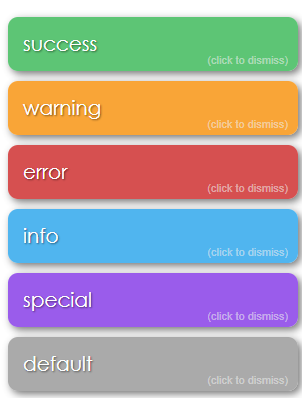

# x5 Notify ([Live Demo](https://codesandbox.io/s/x5-notify-example-xozh8?hidenavigation=1&view=preview))


This is a lightweight notice plugin.

:warning: This plugin is in development, so please let me know if you find any errors.



## Installation

```bash
# npm
npm install x5-notify
```

## Deployment

This plugin does require a [Vuex store](https://vuex.vuejs.org/) and can be installed like any Vue plugin in your entry
point:

```js
Vue.use(Vuex)
const store = new Vuex.Store()

import x5Notify from 'x5-notify'
Vue.use(x5Notify, store)

new Vue({
  el: '#app',
  store: store,
  render: (h) => h(App),
})
```

This plugin uses a component to house all the magic, so it's recommended to put this near the end of your Vue app (e.g.
bottom of your App.vue template)

```html
<div id="app">
  ...
  <x5-notify></x5-notify>
</div>
```

| Attribute |  Type  |   Default    | Description                                                |
| :-------- | :----: | :----------: | :--------------------------------------------------------- |
| position  | String | bottom-right | Origin of notices - see options below\*                    |
| zIndex    | Number |    `200`     | `z-index` style for plugin                                 |
| max       | Number |     `5`      | Limit number of open notices (use `0` to remove limit)\*\* |

:info: \* Positions options: `top-left`, `top-center`, `top-right`, `center-left`, `center-center`, `center-right`, `bottom-left`, `bottom-center`, `bottom-right`

:warning: \*\* `onClose()` callbacks disabled for notices exceeding notice limit.

<br>

# Usage

## Quick Method - `this.$notice(type, text)`

```js
this.$notice('success', 'This is a success notice')
```

## Full Method: `this.$notice(options)`

```js
this.$notice({ type: 'success', text: 'This is a success notice', wait: 5 })
```

| Options      |   Type   |       Default        | Description                                                        |
| :----------- | :------: | :------------------: | :----------------------------------------------------------------- |
| type         |  String  |       default        | One of `success`, `warning`, `error`, `info`, `special`, `default` |
| text         |  String  |          --          | Notice text (required) - **can be HTML**                           |
| onClose      | Function |          --          | Callback for when the notice is closed                             |
| onClick      | Function |          --          | Callback for clicking on the notice                                |
| onClickText  |  String  | "(click to dismiss)" | Description of click action (bottom right hand corner)             |
| wait         |  Number  |         `5`          | Time in seconds before notice is destroyed                         |
| closeOnClick | Boolean  |        `true`        | Closes the notice early if clicked                                 |

<br>

---

## Contributing

Please read [CONTRIBUTING.md](./CONTRIBUTING.md) for the process for submitting pull requests.

## Authors

- [Keagan Chisnall](https://github.com/xon52)

## License

This project is licensed under the MIT License - see the [LICENSE.md](LICENSE.md) file for details

## Acknowledgements

**Inspired by:**

- The look and feel of [alertifyJS](https://alertifyjs.com/)
- The size and code of [vue-toast-notification](https://github.com/ankurk91/vue-toast-notification) by @ankurk91
